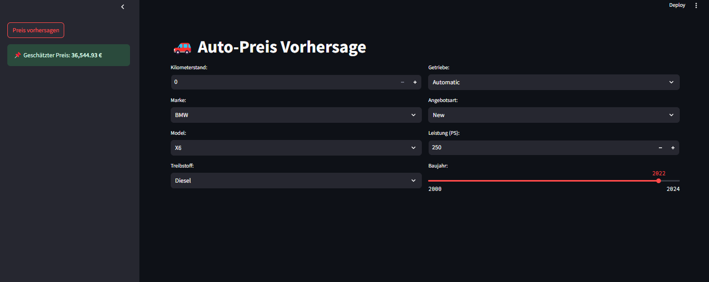
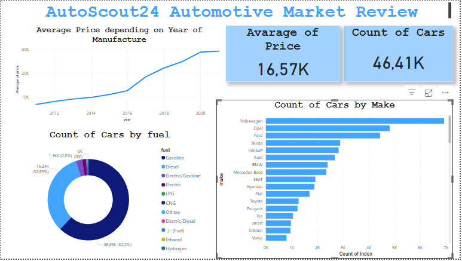

# AutoScout24
# 🚗 Fahrzeuganalyse von AutoScout24 — Case Study mit Machine Learning


Datenanalyse basierend auf dem Kaggle-Datensatz.

---

## 📌 Projektbeschreibung

In diesem Projekt wird der deutsche Gebrauchtwagenmarkt anhand eines Kaggle-Datensatzes untersucht. Die Analyse umfasst die Preisdynamik, Fahrzeugeigenschaften und Markttrends. Darüber hinaus wurde eine Webanwendung zur Preisvorhersage basierend auf dem Machine Learning-Modell *RandomForest* entwickelt. Zur Visualisierung der Forschungsergebnisse wurde die Anwendung **Power BI** verwendet.

---

## 🎯 Projektziele

✔ Gebrauchtwagenpreisanalyse in Deutschland 

✔ Überprüfung der numerischen und kategorischen Merkmale des Autos (Marke, Modell, Kilometerstand, Baujahr)  

✔ Visualisierung von Markttrends (z.B. Preisdynamik, Antriebsarten)  

✔ Erstellung von Preisvorhersagemodellen mit Machine Learning

---
### 🚗 Beispiel für die Preisvorhersage-Anwendung

Hier ist ein Bild, das die Anwendung in Aktion demonstriert:

)

---

## 📊 Datenquelle & Verarbeitung

### 🔹 Datenquelle
Die Fahrzeugdaten stammen aus dem Kaggle-Datensatz:  
👉 [Cars Germany Dataset on Kaggle](https://www.kaggle.com/datasets/ander289386/cars-germany)

### 🔹 Datenverarbeitungsschritte - `deskriptive_analyse.ipynb`

1. **Datenaufbereitung und Deskriptive Analyse**
   - 1.1 **Daten laden & erste Inspektion**
   - 1.2 **Duplikate und fehlende Werte behandeln**
   - 1.3 **Daten normalisieren**
   - 1.4 **Datenvisualisierung zur ersten Analyse**
     - 1.4.1 Häufigkeit von Kategorien analysieren.
     - 1.4.2 Wichtige Zusammenhänge erkennen, Ausreißer identifizieren und erste Hypothesen über Einflussfaktoren aufstellen.
     - 1.4.3 Streudiagramme und Korrelationen.
  
2. **Daten für das Machine Learning-Modell vorbereiten**
   - 2.1 **Umwandlung von kategorialen Variablen** (Feature Encoding)
   - 2.2 **Skalierung der numerischen Variablen**
   - 2.3 **Erkennen und Entfernen von Datenausreißern**
   - 2.4 **Korrelationen zwischen Features**
   - 2.5 **Aufteilung in Trainings- und Testdaten**

3. **Erste Machine Learning-Modelle testen**
   - 3.1 **Lineare Regression anwenden**
   - 3.2 **DecisionTreeRegressor anwenden**
   - 3.3 **RandomForestRegressor anwenden**
   - 3.4 **Hyperparameter-Tuning mit GridSearchCV**

---

## 🔧 Technologien & Tools

**Programmiersprache**: Python  
**Datenanalyse**: Pandas, NumPy  
**Datenvisualisierung**: Matplotlib, Seaborn  
**Web-App**: Streamlit  
**Machine Learning**: sklearn, RandomForestRegressor, train_test_split, LabelEncoder, StandardScaler, GridSearchCV, DecisionTreeRegressor, LinearRegression, mean_squared_error, r2_score

---

## 🚀 Nutzung des Codes

### 🔹 Installation

1. **Repository klonen:**

```bash
git clone https://github.com/AVMatvieieva/data-science-portfolio/tree/main/AutoScout24.git
cd AutoScout24
```
Um die Anwendung zu starten, müssen Sie einige Schritte ausführen:

2. **Datenvorbereitung / Modelltraining / Starten der Anwendung**

 Führen Sie das Skript aus, um die Daten vorzubereiten. 

 ```bash
 python data_preparation.py
```
Nachdem Sie die Daten vorbereitet haben, trainieren Sie das Modell, indem Sie das folgende Skript ausführen.
```bash
python train_model.py
```

Sobald die Daten vorbereitet und das Modell trainiert ist, können Sie die Anwendung selbst ausführen:

```bash
python app.py
```
---
## 📈 Visualisation der Analyse mit Power BI
)
[https://github.com/AVMatvieieva/AutoScout24/blob/main/AutoScout24%20Automotive%20Market%20Review.pbit](https://github.com/AVMatvieieva/AutoScout24/blob/main/AutoScout24%20Automotive%20Market%20Review.pbit)


Einige interessante Erkenntnisse aus der Datenanalyse:

Preisentwicklung: Neuere Fahrzeuge (Baujahr 2019–2021) haben stabilere Preise.

Beliebteste Marken: Volkswagen, Opel, Ford, Skoda, Renault, Audi, BMW und Mercedes dominieren den Markt.

Antriebsarten: Elektrofahrzeuge gewinnen mit 2,5 % an Bedeutung, Benzin- und Dieselfahrzeuge sind mit 62,2 % bzw. 32,85 % jedoch weiterhin am weitesten verbreitet.

---
## 🚀 Fazit & Ausblick
✅ Fazit: Diese Analyse bietet wertvolle Einblicke in den deutschen Gebrauchtwagenmarkt und zeigt, wie Machine Learning genutzt werden kann, um Fahrzeugpreise vorherzusagen.


